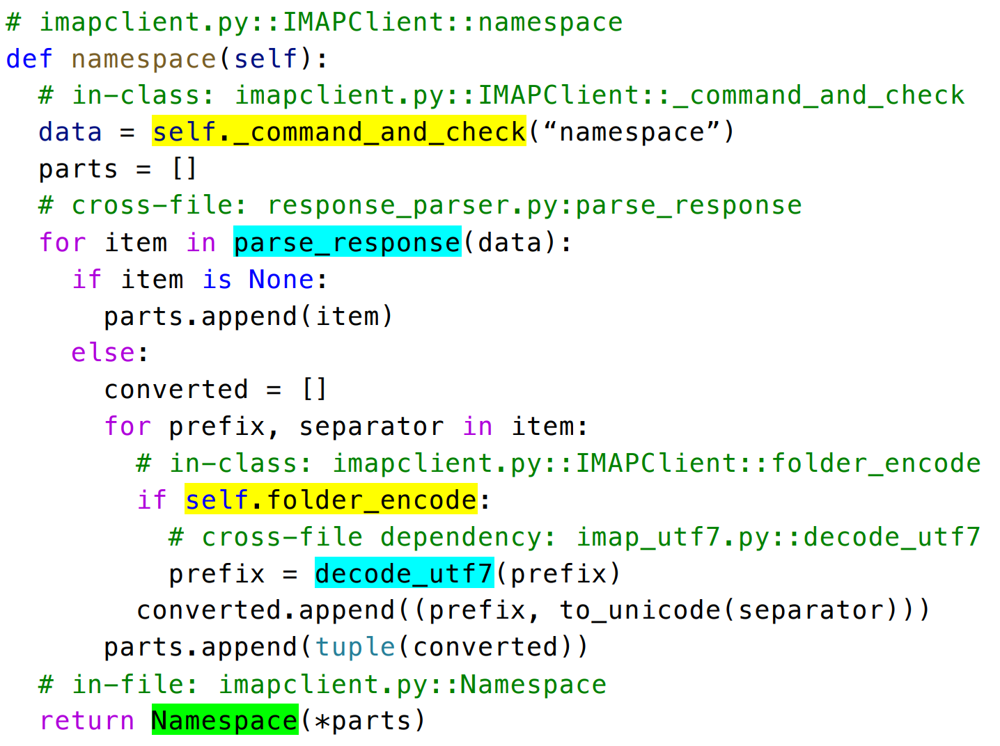
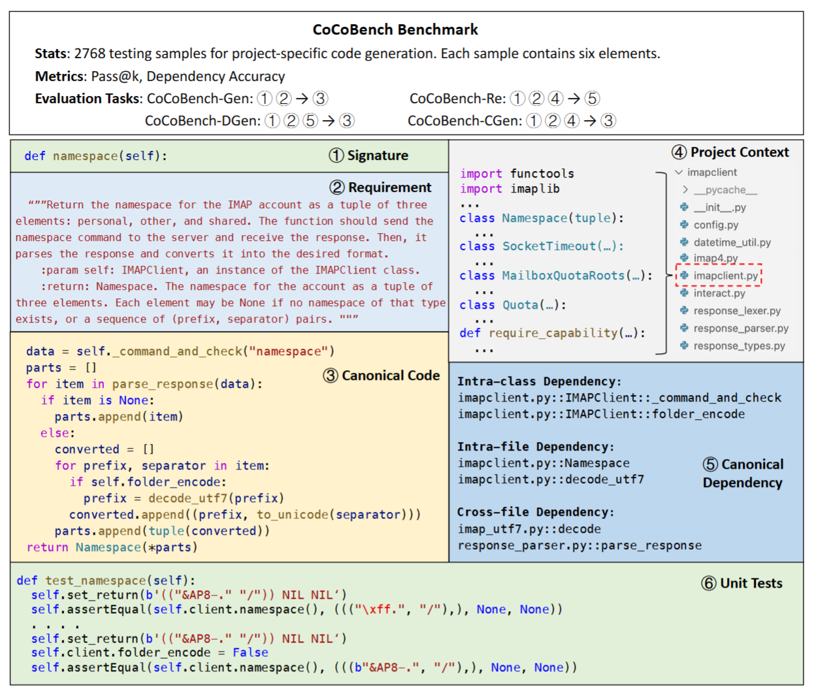
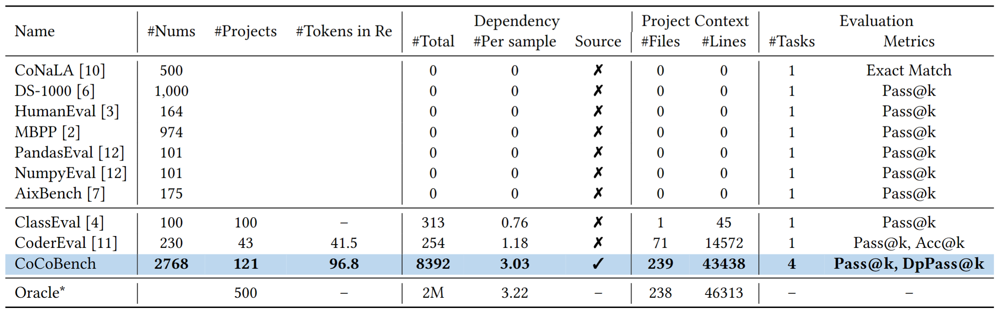

# CoCoBench
## 在项目特定代码生成中评估大型语言模型
  
## 作者  
  
李佳，北京大学 \
李泳民，北京大学 \
赵云飞，北京大学  

## 关键词  
  
语言模型，代码生成，项目特定代码 
  
## 一、引言  

大型语言模型（LLM）最近在代码生成方面表现出了令人印象深刻的能力，提出了许多基准测试来评估独立代码生成，但实际的开发场景和独立代码生成之间存在差距。人类开发人员通常为特定项目编写程序，需要根据项目上下文编写非独立程序。非独立程序往往包含许多特定于项目的依赖项，即在项目上下文中定义的变量和函数。

{:height="70%" width="70%"}

**分析500个开源项目中的200多万个函数** \
-> **80%的函数依赖于当前的项目，函数平均包含3.22个依赖项** \
-> **三种类型:** \
 | 类内依赖关系 \
 | 文件内依赖关系 \
 | 跨文件依赖关系

 
显然，基于需求和项目上下文生成非独立代码在实际软件开发中至关重要，而且具有挑战性。迫切需要一个更高质量的基准来评估LLM在实际开发场景中的能力。

在本文中，我们提出了一个新的项目特定代码生成基准，名为CoCoBench, 包含121个项目的2768个测试样本

## 二、数据形式 

样本由以下元素组成：
- **Requirement** 描述目标代码功能的自然语言描述。要求用英文人工编写。
- **Function Signature** 函数名称和输入参数。
- **Project Context** 当前样本所在项目的现有代码文件（例如，数百个Python文件）。我们保留了这些项目的原始文件结构（例如，代码文件的名称和路径）和代码样式。
- **Canonical Code** 要生成的代码的实际实现。它由开发人员编写，并调用项目上下文中定义的一些依赖项。
- **Canonical Dependency** 实际实现代码中调用的依赖项。包括类内、文件内和跨文件依赖。
- **Unit Tests** 测试用例，用于验证生成代码的功能正确性。

  
## 三、与其他常用基准的比较
 

  
## 四、具体流程和细节 

### 项目选择和收集

### 函数分析与提取

### 测试搭建与运行

### 需求注释与核验
  
## 五、实验结果与分析  
   

  