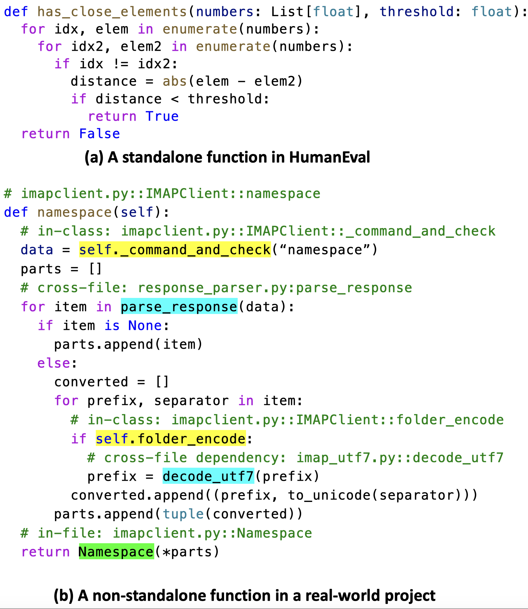
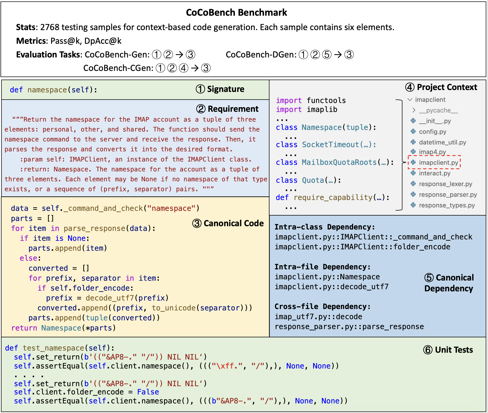
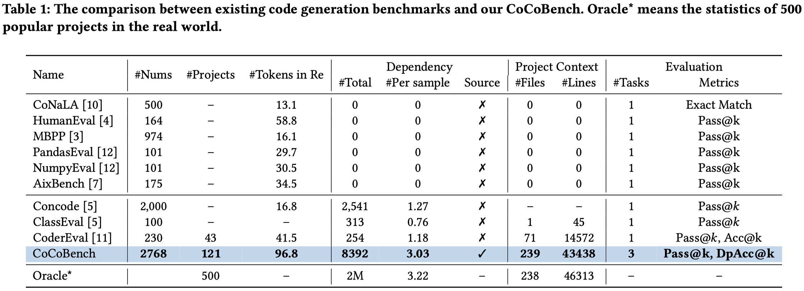

# CoCoBench - A Context-based Code Generation Benchmark
## Motivation

<!-- insert the motivation image and resize its size -->

Mainstream code generation benchmarks are designed for generating **standalone** code. However, in real-world software development, developers often need to generate **non-standalone** code. 
The above figure shows a standalone functon and a non-standalone function. The standalone function is independent of other functions and can be executed alone. In contrast, the non-standalone function invokes other functions (i.e., dependencies) defined in the same project.
Among 2.2 million Python functions in 500 open-source projects, 80% of functions have project-internal dependencies, and on average, each function has 3.22 dependencies. Thus, generating non-standalone code based on the project context is important in real-world software development.

To evaluate the capability of code generation models in real-world software development, we propose a new benchmark - CoCoBench.

## CoCoBench

CoCoBench contains 2768 testing samples from 121 open-source Python projects. Each sample contains a natural language requirement, a function signature, a project context, a canonical code, a canonical dependency, and unit tests.

As shown in the above figure, each sample consists of the following elements:
- **Requirement**: A natural language description of the target code functionality. Requirements are manually written by 11 Ph.D. students in English.
- **Function Signature**: The function name and input parameters.
- **Project Context**: The existing code files in the current sample's project (e.g., hundreds of Python files). We preserve the original file structure (e.g., the file names and paths) and coding style of these projects.
- **Canonical Code**: The offical implementation of the code to be generated. It is written by developers and invokes some dependencies defined in the project context.
- **Canonical Dependency**: The dependencies invoked in the canonical code. It includes intra-class, intra-file, and cross-file dependencies.
- **Unit Tests**: The test cases for verifying the functionality of the generated code.

### Evaluation Tasks
We define three evaluation tasks on CoCoBench.

- **General Code Generation (CoCoBench-Gen)**:Generating the code based on a function signature and a requirement. CoCoBench-Gen aims to evaluate the ability of LLMs to generate non-standalone code without the project context. This task can be seen as a baseline in our experiments.
- **Dependency-based Code Generation (CoCoBench-DGen)**: Generating the code based on a function signature, a requirement, and the canonical dependencies. CoCoBench-DGen assumes that canonical dependencies are known and evaluate whether LLMs understand these dependencies and invoke them at proper locations.
- **Context-based Code Generation (CoCoBench-CGen)**: To simulate the end-to-end real-world coding scenario, we propose CooBench-CGen. It first retrieves relevant dependencies from the project context and then generates code based on the dependencies. It is the most challenging task in our paper. 

### Evaluation Metrics
We define two metrics to evaluate the generated code.
- **Pass@k (Functional Correctness)**: We use unit tests to evaluate the functional correctness of the generated code. Pass@k is the percentage of generated code that passes all unit tests.
- **DpAcc@k (Dependency Accuracy)**: We use the canonical dependencies to evaluate the dependency accuracy of the generated code. DpAcc@k is average dependency accuracy of all generated code snippets. The dependency accuracy of a generated code is the percentage of canonical dependencies that are invoked in the generated code.

## Why Choose CoCoBench

Compared to existing benchmarks, CoCoBench is closer to real-world software development. To validate this, we conduct a large-scale empirical study on 500 open-source Python projects. We calculate the average values of 500 projects in different metrics and compare them with existing benchmarks.

The above figure shows the comparison results. **Oracle** is the statistics of 500 projects. Compared to existing benchmarks, CoCoBench shows the following advantages:

**(1) More dependencies Labeled with Sources**: CoCoBench contains a total of 8,392 dependencies, and each sample has 3.03 dependencies on average. Obviously, the number of dependencies in CoCoBench not only significantly exceeds the number of dependencies in previous benchmarks (e.g., CoderEval: 254), but also is closer to the average number of dependencies in 500 real-world projects. 
  
On the other hand, we annotate the sources of canonical dependencies. Canonical dependencies are ground truths and are used to evaluate the accuracy of dependencies in LLMs' outputs. Previous work (i.e., CoderEval) only provides the names of canonical dependencies, such as `close`. However, there are often a large number of functions with the same name in software projects. It is hard to identify whether the generated dependencies are correct by relying on their names alone. It leads to a biased (i.e., higher) accuracy of dependencies in previous work.
Our CoCoBench provides the sources of canonical dependencies, e.g., `A.py::ClassB::close`. The sources clearly identify different dependencies and eliminate ambiguity.

**(2) More complex project context**: The scale of the project context in previous benchmarks is small, much lower than the scale in real projects, e.g., CoderEval: 71 files vs. Oracle*: 238 files. In contrast, CoCoBench provides the more complex project context that contains 239 code files on average. Thus, CoCoBench builds a practical development scenario to assess LLMs on project-specific code generation.

**(3) More evaluation tasks**: Besides the general code generation, CoCoBench proposes two evaluation tasks to assess the context-based coding ability of LLMs in multiple aspects. 
Dependency-based code generation is to generate the code based on the requirement and canonical dependencies. It measures whether LLMs can understand dependencies and invoke them correctly during generation. Context-based code generation is to simulate an end-to-end code generation scenario, i.e., generating the code based on the requirement and the project context. For all tasks, we design two evaluation metrics, i.e., Pass@k for the functional correctness and DpAcc@k for the dependency accuracy.

CoCoBench also has advantages in the **scale** and **requirements**. CoCoBench contains 12x more samples than CoderEval (i.e., 2,768 vs. 230) and comes from 121 projects covering 10 domains (e.g., Text Processing, Internet, Database). Thus, CoCoBench provides diverse programming scenarios for comprehensively evaluating LLMs. Besides, we hired 11 Python developers to manually write requirements for each sample and cost 200 person-hours in total. The annotators are asked to write clear and informative requirements, that include the purpose of programs, input-output parameters, and a concise solving process. Finally, the length of requirements in CoCoBench is 96.8 tokens and is approximately 2.3 times that of CoderEval.

## Download
CoCoBench will be released in 12/2023. Please stay tuned.

## Contributors
- [Jia Li](https://lj2lijia.github.io/), Peking University, China (lijia@stu.pku.edu.cn)
- Yunfei Zhao, Peking University, China (zhaoyunfei@pku.pku.cn)
- Yongmin Li, Peking University, China (liyongmin@pku.edu.cn)